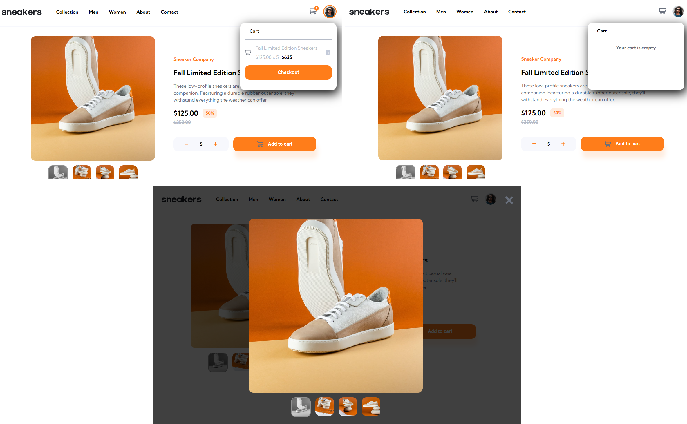
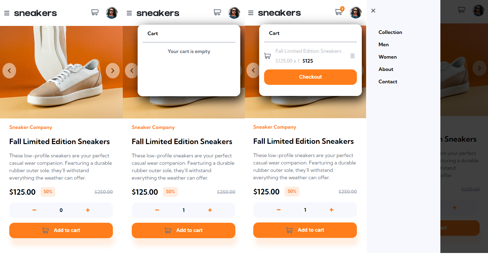

# Frontend Mentor - E-commerce product page solution

This is a solution to the [E-commerce product page challenge on Frontend Mentor](https://www.frontendmentor.io/challenges/ecommerce-product-page-UPsZ9MJp6). Frontend Mentor challenges help you improve your coding skills by building realistic projects.

## Table of contents

- [Overview](#overview)
  - [The challenge](#the-challenge)
  - [Screenshot](#screenshot)
  - [Links](#links)
- [My process](#my-process)
  - [Built with](#built-with)
  - [What I learned](#what-i-learned)
  - [Continued development](#continued-development)
- [Author](#author)

## Overview

### The challenge

Users should be able to:

- View the optimal layout for the site depending on their device's screen size
- See hover states for all interactive elements on the page
- Open a lightbox gallery by clicking on the large product image
- Switch the large product image by clicking on the small thumbnail images
- Add items to the cart
- View the cart and remove items from it

### Screenshot

### Links

- Solution URL: [https://github.com/Helbindi/ecommerce-product]()
- Live Site URL: [https://helbindi-ecommerce-product.vercel.app/]()

## My process

### Built with

- Semantic HTML5 markup
- CSS custom properties
- Flexbox
- CSS Grid
- Mobile-first workflow
- [React](https://reactjs.org/) - JS library

### What I learned

For this project, the goal was to build reuseable components for the repeated UI elements thoughout the design specifications.

### Continued development

- Utilize more React Hooks (Reducer and Context)
- Better CSS styling/management or use Preprocessor
- Learn to use Grid more often, always doing Flexbox

## Author

- Website - [https://my-projects-site.vercel.app/]()
- Frontend Mentor - [@Helbindi](https://www.frontendmentor.io/profile/Helbindi)
